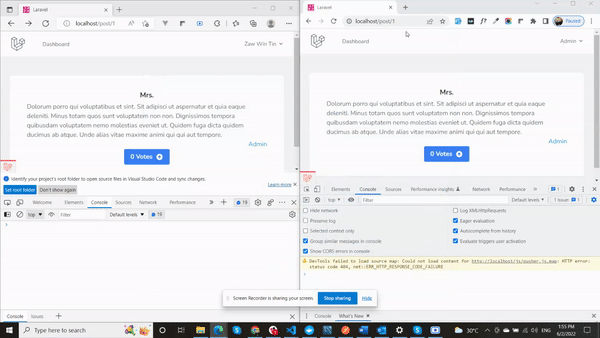

# How to use Pusher in Laravel Broadcast

In this example, I will use Pusher with _AlpineJS_ !


### Server Side Installation
In **cmd**,
```
composer require pusher/pusher-php-server
```
**env** file
```
BROADCAST_DRIVER=pusher
```
```
PUSHER_APP_ID=your-pusher-app-id
PUSHER_APP_KEY=your-pusher-key
PUSHER_APP_SECRET=your-pusher-secret
PUSHER_APP_CLUSTER=mt1

MIX_PUSHER_APP_KEY="${PUSHER_APP_KEY}"
MIX_PUSHER_APP_CLUSTER="${PUSHER_APP_CLUSTER}"
```
Make sure _BroadcastServiceProvider_ is uncommented in **app.php**

```php
App\Providers\BroadcastServiceProvider::class,
```
### Client Side Installation
In **cmd**,
```
npm install --save-dev laravel-echo pusher-js
```
**app.js**
```js
import Echo from 'laravel-echo';
 
window.Pusher = require('pusher-js');
 
window.Echo = new Echo({
    broadcaster: 'pusher',
    key: process.env.MIX_PUSHER_APP_KEY,
    cluster: process.env.MIX_PUSHER_APP_CLUSTER,
    forceTLS: true
});
```
### After Installation,
Create Event
```
php artisan make:event EventName
```
In my event class, event will look like this...<br>
_(Note: Be sure to implement **ShouldBroadcast**)_
```php
class VoteUpdated implements ShouldBroadcast
{
    use Dispatchable, InteractsWithSockets, SerializesModels;

    public $user;
    public $post;

    /**
     * Create a new event instance.
     *
     * @return void
     */
    public function __construct($user, $post)
    {
        $this->user = $user;
        $this->post = $post;
    }

    /**
     * Get the channels the event should broadcast on.
     *
     * @return \Illuminate\Broadcasting\Channel|array
     */
    public function broadcastOn()
    {
        return new PrivateChannel('vote-live.' . $this->post->id);
    }
}
```
In **channels.php**, We can check authentication to access channel. In this example, I will only check for logged in user or not.
```php
Broadcast::channel('vote-live.{id}', function($user, $id) {
    return Auth::check();
});
```
Now, It is ready to broadcast. In this example, I will broadcast when user votes post. Therefore, in my **PostController**,
```php
class PostController extends Controller
{
    public function vote($id)
    {
        $post = Post::findOrFail($id);
        $post->no_of_votes = $post->no_of_votes + 1;
        $post->save();
        $responseValue = array(
            'message' => 'Vote Success',
            'post' => $post,
        );
        broadcast(new VoteUpdated(auth()->user(), $post))->toOthers();
        return response()->json($responseValue);
    }
}
```
_(Note: **toOthers()** means it will broadcast everyone except current user)_<br>

In my js file, it will need to listen broadcasted channel. That's why I try to listen as ...
```js
document.addEventListener("alpine:init", () => {
    Alpine.data("app", () => ({
        ...alpineData,
        init() {
            Echo.private("vote-live." + this.postId).listen("VoteUpdated", (e) => {
                // What you want to do
            });
        },
```
_(Note: In my example, **VoteUpdated** is created Event Name and **"vote-live.{id}"** is channel name)_

We are now ready to give our application using the **Pusher**, **AlpineJS** and **Laravel Broadcast**.

Let’s compile our front-end assets:
```
npm install
npm run dev
```
… and run our server:
```
php artisan serve
```
And Result will look like this ...

